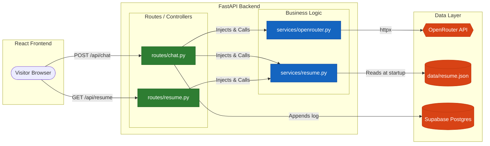
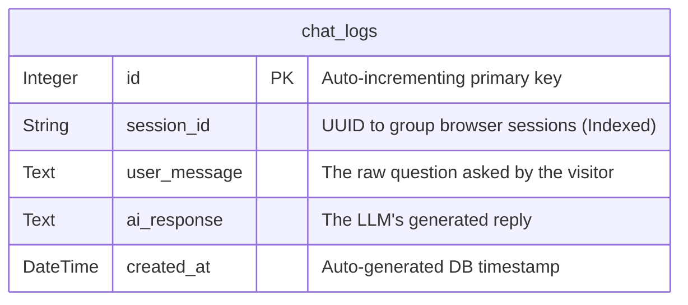
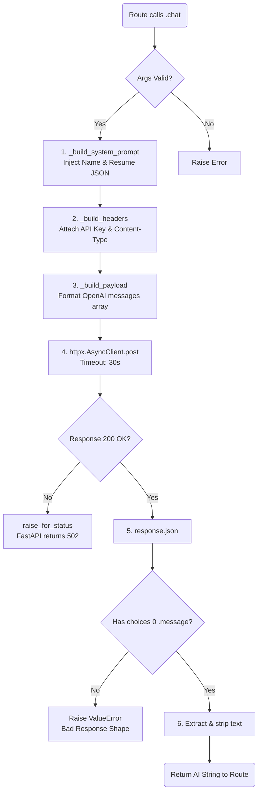
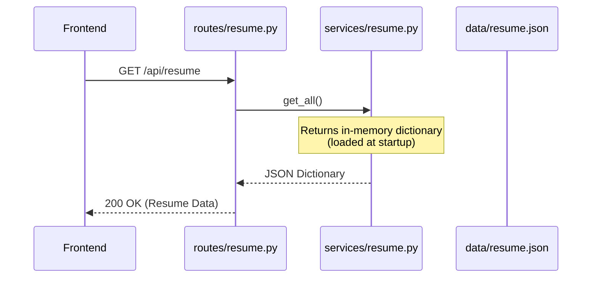
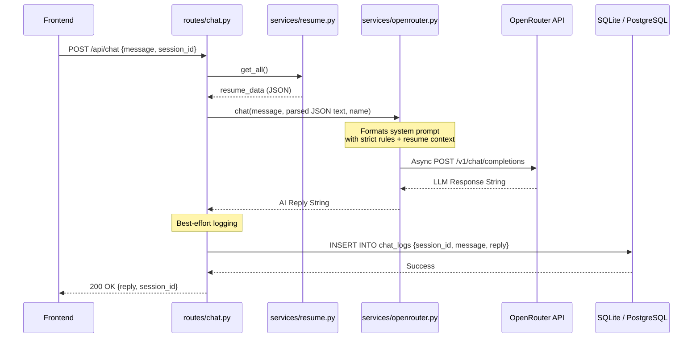
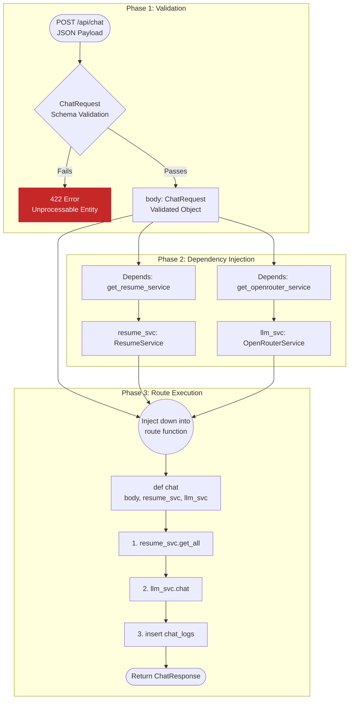
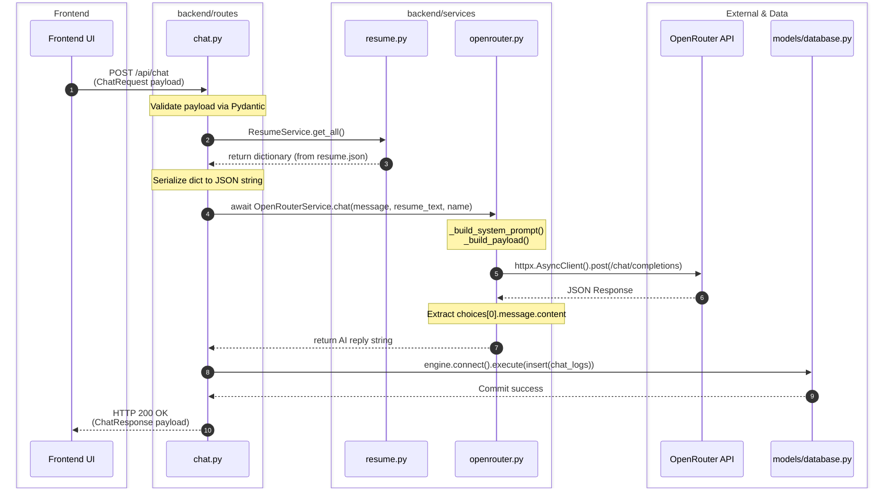

# Backend Architecture Documentation

This document provides a comprehensive overview of the portfolio backend's architecture, including file responsibilities, data flow, API behavior, database interactions, and execution dry runs.

## 📁 Directory & File Structure

The backend follows a modular, single-responsibility architecture, strongly adhering to SOLID principles.

- **`main.py`**: The FastAPI application entry point. Handles app initialization, CORS configuration, route registration (`/api`), and database table creation on startup. Contains *no* business logic.
- **`config/settings.py`**: Centralized configuration management. Loads environment variables from `.env` (like `OPENROUTER_API_KEY`, `DATABASE_URL`) ensuring other modules don't call `load_dotenv` directly.
- **`models/database.py`**: Database engine setup and table definitions using SQLAlchemy Core. Defines the `chat_logs` table schema and the `create_tables` startup function.
- **`routes/`**: Contains HTTP route handlers. These files only handle request validation and dependency injection; they delegate logic to services.
  - **`chat.py`**: Handles `POST /api/chat`. Validates incoming chat schemas, calls `ResumeService` for context, uses `OpenRouterService` for the LLM reply, and logs the exchange to the database.
  - **`resume.py`**: Handes `GET /api/resume` (serves the structured JSON resume) and `GET /api/health` (Cloudflare/uptime health check).
- **`services/`**: Contains core business logic and external integrations.
  - **`openrouter.py`**: Wraps the OpenRouter API. Builds the LLM system prompt using the candidate's resume, defines the strict conversational rules, and makes the async HTTP request via `httpx`.
  - **`resume.py`**: Reads and parses `data/resume.json` at startup. Provides methods to retrieve the full JSON object or format it as plain-text for the LLM context.
### Architecture Pattern: Route-Service Separation
The project uses the **Controller-Service Pattern**. Routes only handle HTTP communication, delegating all business logic to Services.
    

---

## 🗄️ Database Design

The system uses **SQLAlchemy Core** (instead of the heavier SQLAlchemy ORM) to keep the app highly performant. `models/database.py` manages the connection pool and stores table schemas.

### Database Engine & Connection (`models/database.py`)
The `engine` object in this file is the beating heart of your data layer. 
- It dynamically adapts to either a local SQLite file (no SSL) or a remote Supabase Postgres DB (forces `sslmode=require`).
- Uses `pool_pre_ping=True` to gracefully handle dropped connections without crashing the app.
- Contains an asynchronous `create_tables()` function called ONLY at startup by `main.py`.

### Schema: `chat_logs`
An append-only table to store question-and-answer pairs for analytics and debugging.

*Note: Database logging is implemented as "best-effort" in `chat.py`. If the DB insert fails during a chat, it surfaces a 500 error to the route but doesn't crash the server.*

### `services/openrouter.py` Flowchart
This service is the isolated wrapper for all LLM network communication.

---

## 🔄 API Calls & Data Flow

### 1. `GET /api/resume`
Fetches the candidate's data to dynamically render the frontend UI.

### 2. `POST /api/chat`
Handles user questions by combining the message with resume data and querying the LLM.

---

### FastAPI Execution Lifecycle (`routes/chat.py`)
This diagram illustrates the exact chronological execution flow of how FastAPI handles validation and Dependency Injection *before* the business logic runs.

## 🏃 Execution Dry Runs (Step-by-Step)

### Scenario A: Application Startup
1. `uvicorn main:app` is executed.
2. `config/settings.py` resolves paths and loads `.env` variables (`DATABASE_URL`, `OPENROUTER_API_KEY`).
3. `services/resume.py` initializes, securely loading `data/resume.json` into memory.
4. FastAPI initializes the app instance.
5. The `@asynccontextmanager` lifespan triggers `create_tables()`.
6. `models/database.py` connects to the DB and creates the `chat_logs` table if it doesn't exist.
7. Routes are registered under `/api`, CORS is applied, and the server begins listening.

### Scenario B: A user asks, "What are Rohit's skills?"

1. **Request:** Frontend generates UUID `123e4567` and sends `POST /api/chat` with `{"message": "What are Rohit's skills?", "session_id": "123e4567"}`.
2. **Validation:** `ChatRequest` Pydantic model validates the payload.
3. **Data Retrieval:** The route calls `ResumeService.get_all()`, fetching the cached resume dictionary. It extracts the name "Rohit" and serializes the full data back to a JSON string.
4. **LLM Prompting:** The route calls `OpenRouterService.chat()`.
   - The service injects the JSON string into `_SYSTEM_PROMPT_TEMPLATE`.
   - The template enforces strict response behavior rules.
5. **Network Call:** An async `httpx` POST is made to OpenRouter's `chat/completions` endpoint using the configured model.
6. **Response Processing:** OpenRouter returns the AI response within 2-5 seconds. `OpenRouterService` extracts the raw string.
7. **Database Logging:** The route opens a synchronous SQLAlchemy connection and performs an `INSERT` into `chat_logs` with the session ID, query, and reply. The connection is committed.
8. **HTTP Return:** FastAPI wraps the LLM string and session ID in a `ChatResponse` schema and returns it as a `200 OK` JSON response to the browser.
